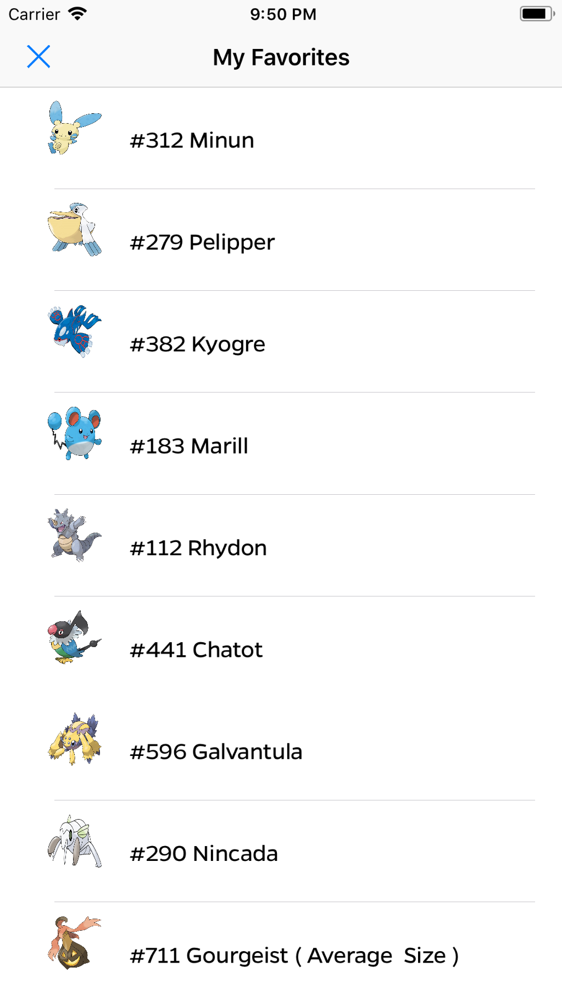

# Pokedex - MDB

## Description
This is our Pokedex application aka MDB MP2. 

It displays the members of MDB for Fall 2018 and gives the user 5 seconds to identify a member based on a picture. The game keeps track of the last three questions proposed, the number of questions answered correctly this game, as well as the user's highest streak. Users can clear their statistics and start the app anew, or simply start a new game with a new score.

## Screenshots
|         |            |   |
| :-------------: | :-------------: | :-------------: |
| Pokedex | Pokemon Profile Page | Favorites Page |

## Acknowledgements
* Adapted Queue Data Structure [\(Swift Algorithm Club\)](https://github.com/raywenderlich/swift-algorithm-club/blob/master/Queue/)
* Font Bolding and Italicizing [\(Stack Overflow\)](https://stackoverflow.com/questions/4713236/how-do-i-set-bold-and-italic-on-uilabel-of-iphone-ipad)
* MDB iOS Instructors/Mentors Max Miranda, Will Oakley, Shubham Gupta
