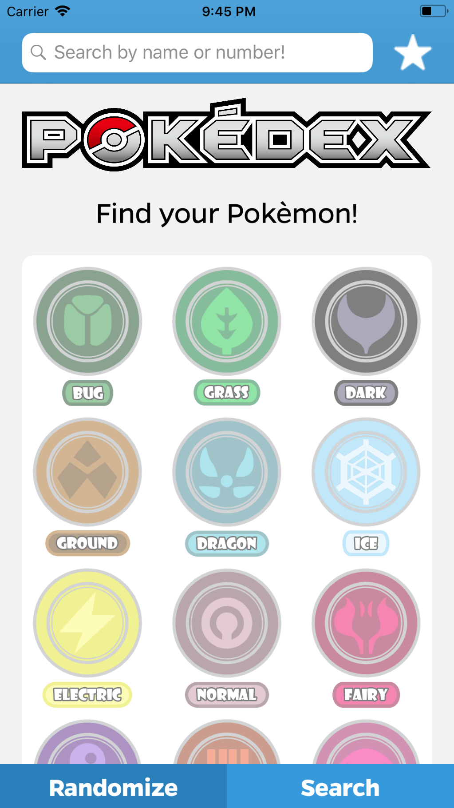

# Pokedex - MDB

## Description
This is our Pokedex application aka MDB MP2. It displays a stored database of Pokemon characters, allowing the user to search for Pokemon by their type, species, and a broad variety of statistical abilities. 

## Screenshots
|         |            |   |
| :-------------: | :-------------: | :-------------: |
| Pokedex | Pokemon Profile Page | Favorites Page |

## Acknowledgements
* Adapted Queue Data Structure [\(Swift Algorithm Club\)](https://github.com/raywenderlich/swift-algorithm-club/blob/master/Queue/)
* Font Bolding and Italicizing [\(Stack Overflow\)](https://stackoverflow.com/questions/4713236/how-do-i-set-bold-and-italic-on-uilabel-of-iphone-ipad)
* MDB iOS Instructors/Mentors Max Miranda, Will Oakley, Shubham Gupta
